# CLOUD-STORAGE-CREATION-S3-AND-LAUNCHING-AN-EC2-INSTANCE-IN-AWS

## EC2 Instance and S3 Buckets

```
Name: Muhammad Afshan A
Register No: 212223100035
```

## Aim:
To create an EC2 instance and an S3 bucket in AWS.
## Procedure
## Step 1: Creating an EC2 Instance
1.	Sign in to the AWS Management Console:

    ○	Go to https://console.aws.amazon.com/

    ○	Log in using your AWS account credentials. Remember to log in with your administrative user, not the root user.

2.	Navigate to the EC2 Service:

    ○	In the AWS Management Console, find "EC2" using the search bar or by navigating through the services menu.

3.	Launch an Instance:

    ○	Click "Launch Instance".

4.	Choose an Amazon Machine Image (AMI):

    ○	Select an AMI (operating system) for your EC2 instance. Choose one that meets your needs (e.g., Amazon Linux 2, Ubuntu, Windows Server). Consider the Free Tier options.

5.	Choose an Instance Type:
    ○	Select an instance type. This determines the hardware configuration of your instance (e.g., CPU, memory). Choose a "t2.micro" instance for the Free Tier, if available.

6.	Configure Instance Details:
    ○	Configure the instance settings, such as the number of instances, network settings (VPC, subnet), and IAM role. For basic setup, you can often accept the defaults.

7.	Add Storage:
    ○	Specify the size and type of storage volumes to attach to your instance. The default is usually sufficient for initial setup. Consider the Free Tier limits.

8.	Add Tags (Optional):
    ○	Add tags to your instance. Tags are key-value pairs that help you organize and manage your AWS resources. For example, you can tag an instance with "Name" = "MyWebAppInstance".

9.	Configure Security Group:
    ○	A security group acts as a virtual firewall for your instance. Configure rules to control inbound and outbound traffic.

        ■	For example, allow SSH access (port 22) from your IP address.

        ■	If you plan to run a web server, allow HTTP access (port 80) and/or HTTPS access (port 443) from 0.0.0.0/0 (all IP addresses). 

    Security Warning: For production environments, restrict access to only necessary IP addresses.

10.	Review and Launch:

    ○	Review your instance configuration.

    ○	Click "Launch".

11.	Create a Key Pair:

    ○	A key pair consists of a public key that AWS stores, and a private key file that you keep. You use the private key to securely connect to your EC2 instance.

        ■	Create a new key pair or select an existing one.

        ■	Important: Download the private key file (.pem file) and store it in a secure location. You will not be able to download it again.

        ■	Acknowledge that you have the private key and click "Launch Instances".

12.	Connect to Your Instance:

    ○	Once the instance has launched, you can connect to it using the private key file and a terminal application (e.g., PuTTY on Windows, or the built-in terminal on macOS and Linux).

    ○	The exact steps vary depending on your operating system. AWS provides instructions in the EC2 console.

<br>

## Step 2: Creating an S3 Bucket
1.	Navigate to the S3 Service:

    ○	In the AWS Management Console, find "S3" using the search bar or by navigating through the services menu.

2.	Create a Bucket:

    ○	Click "Create bucket".
3.	Enter Bucket Name:

    ○	Enter a unique name for your bucket. Bucket names must be globally unique across all AWS accounts.

4.	Choose a Region:

    ○	Select the AWS Region where you want to create the bucket. Choose a region that is geographically close to you or your users.

5.	Configure Bucket Settings:

    ○	Configure bucket settings, such as:

        ■	Object Ownership: Choose who owns the objects in the bucket.

        ■	Block Public Access: By default, S3 buckets are private. It is highly recommended to keep "Block all public access" enabled unless you have a specific reason to make your bucket public. If you need to serve static website content, there are specific steps to follow, but proceed with caution.

        ■	Bucket Versioning: Enable versioning to keep multiple versions of an object in the same bucket. This can be useful for data recovery.

        ■	Tags: Add tags to your bucket for organization and cost tracking.

        ■	Encryption: Enable server-side encryption to protect data at rest. AWS recommends using server-side encryption.

6.	Create Bucket:

    ○	Review your bucket configuration and click "Create bucket".

7.	Upload Objects:

    ○	Once the bucket is created, you can upload objects (files) to it using the AWS Management Console, the AWS CLI, or the AWS SDKs.

## Step 3: Securing your AWS resources.
1.	Secure your AWS account root user:

    ○	Sign in to the AWS Management Console (https://console.aws.amazon.com) as the account owner by choosing Root user and entering your AWS account email address. On the next page, enter your password.

    ○	Turn on multi-factor authentication (MFA) for your root user.

2.	Create user with administrative access:

    ○	Enable IAM Identity Center.

    ○	In IAM Identity Center, grant administrative access to a user.

3.	Sign in as the user with administrative access:

    ○	To sign in with your IAM Identity Center user, use the sign-in URL that was sent to your email address when you created the IAM Identity Center user.


## Output:
### EC2 Instance
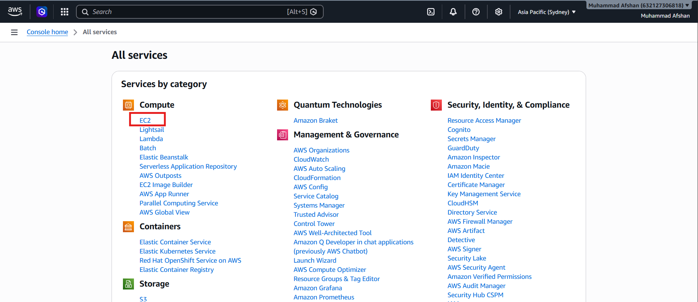

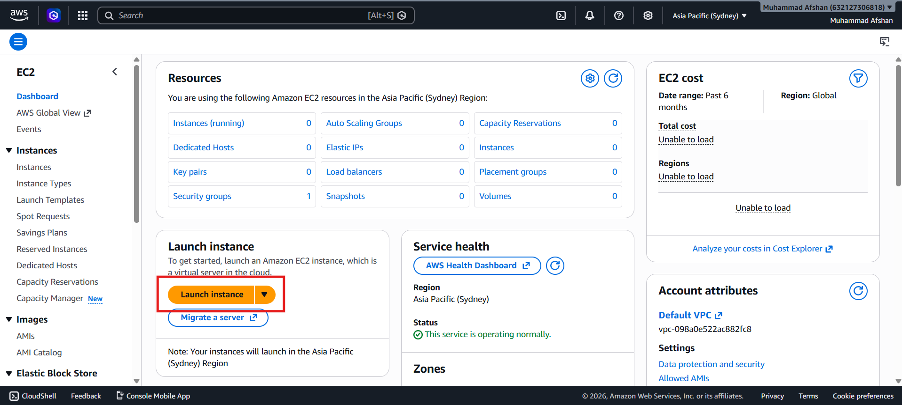

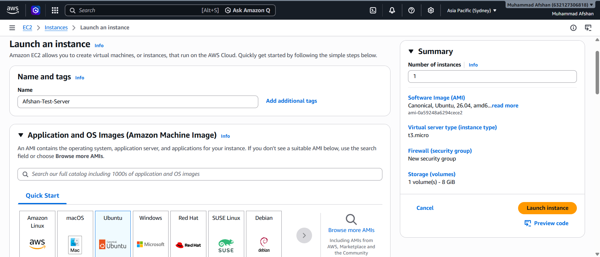

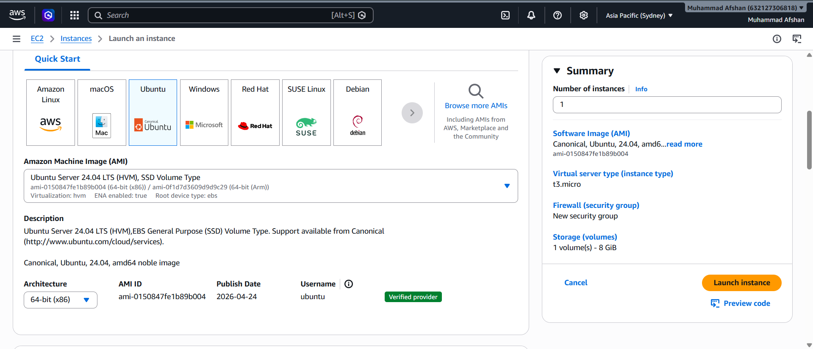

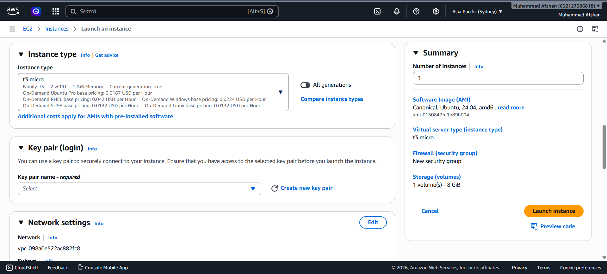

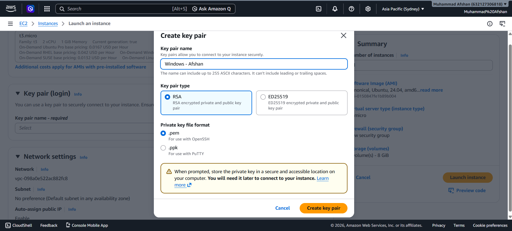

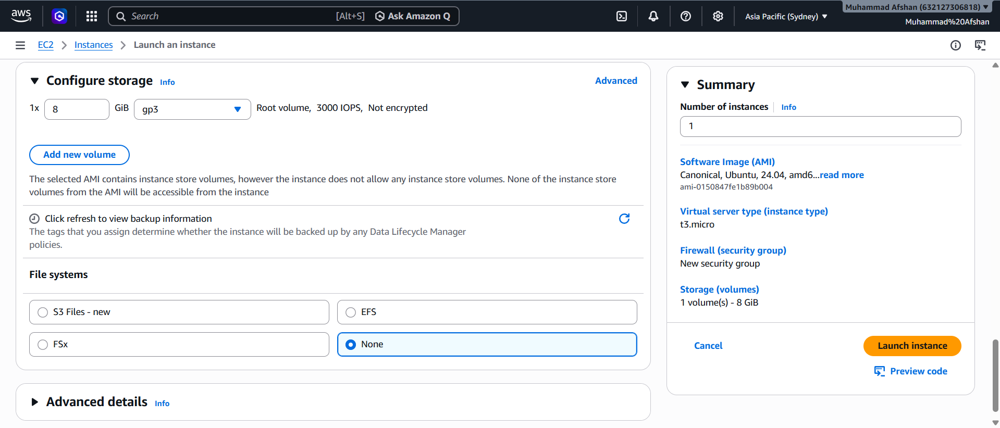

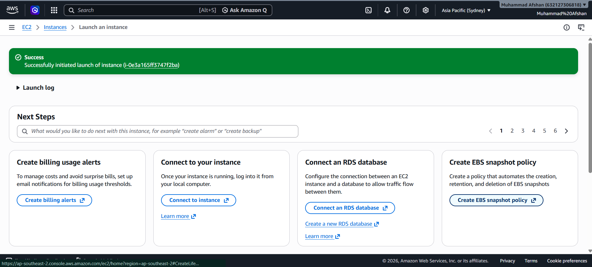

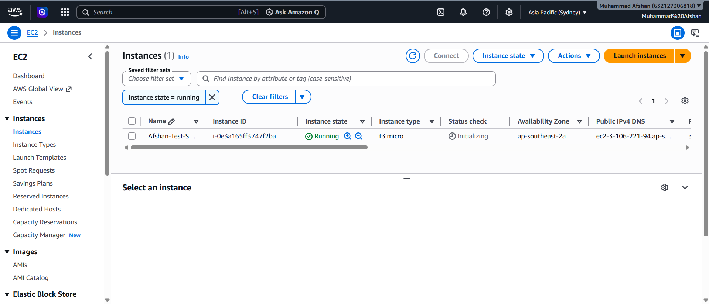

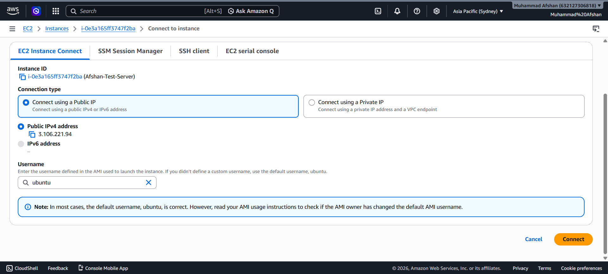

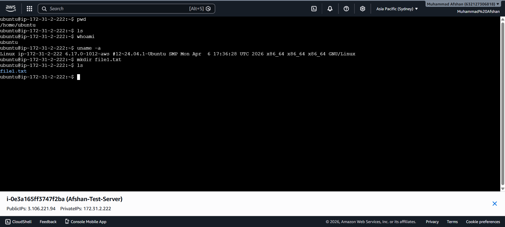

●	An EC2 instance is running in your AWS account.


<br>

### S3 Buckets

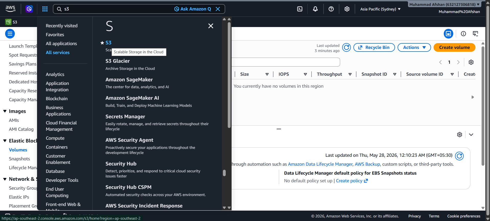

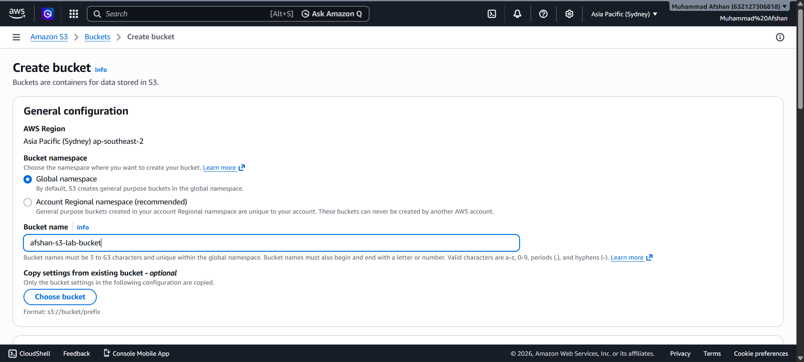

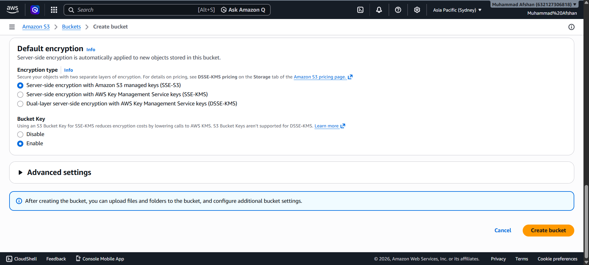

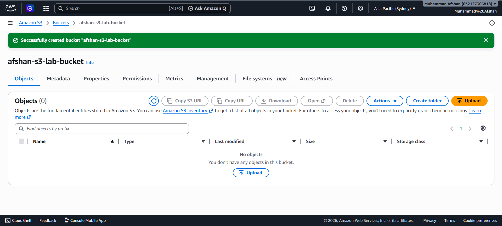

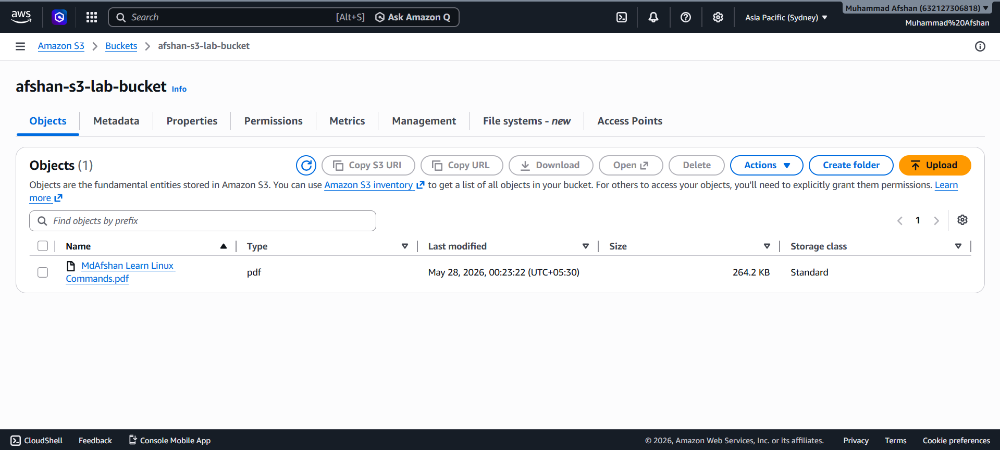
 

 

 

 

 


●	An S3 bucket has been created in your AWS account.


## Result:
An EC2 instance and an S3 bucket were created in the AWS platform.


